# Detailed Implementation Guide for NoteCLI

## Table of Contents
1. [Command Processing System](#command-processing-system)
2. [File Operations System](#file-operations-system)
3. [Version Control Implementation](#version-control-implementation)
4. [Logging System Implementation](#logging-system-implementation)
5. [Error Handling System](#error-handling-system)
6. [Memory Management](#memory-management)

## Command Processing System

### Command Flow Architecture

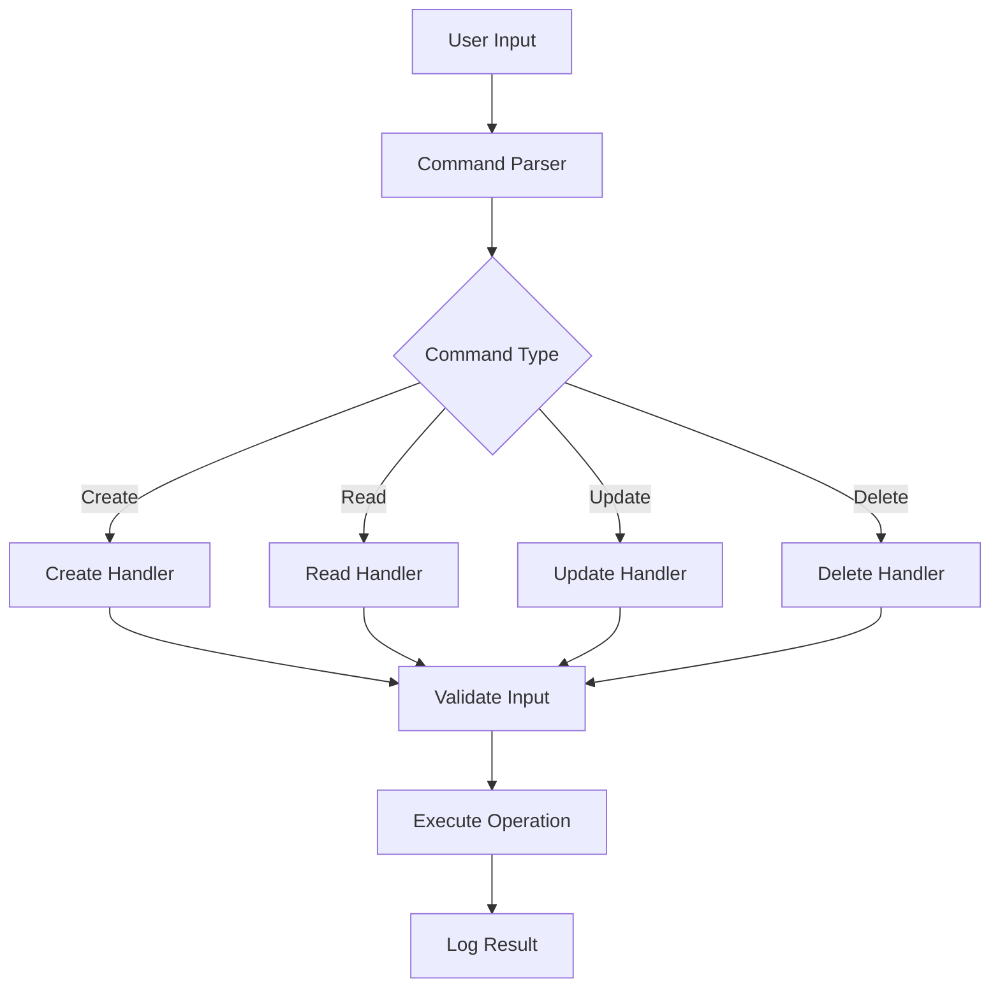

### Command Validation Process

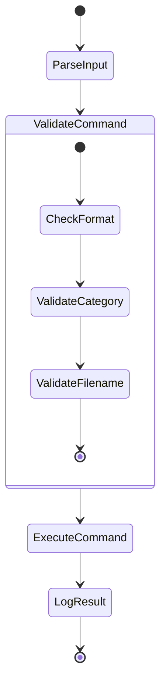

### Command Data Structure

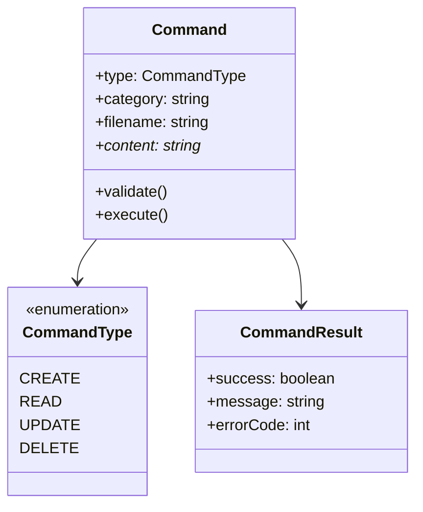

## File Operations System

### File Operation Workflow

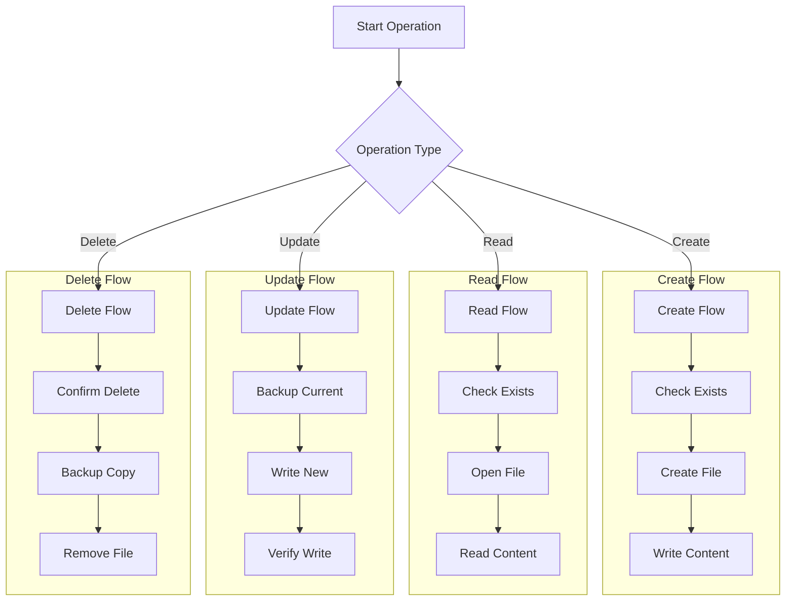

### File System Structure

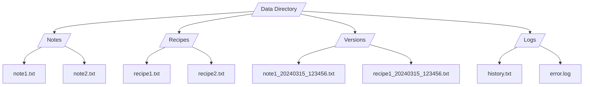

## Version Control Implementation

### Version Control Flow

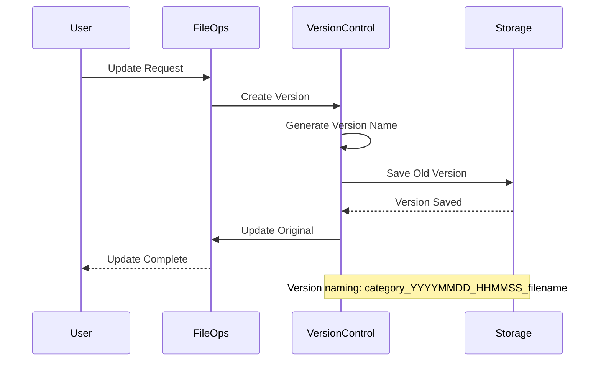

### Version Backup System

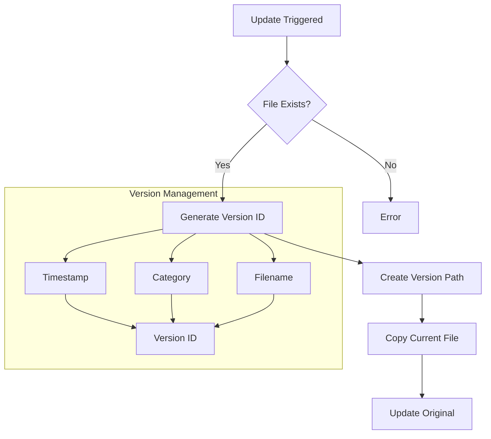

### Version History Structure

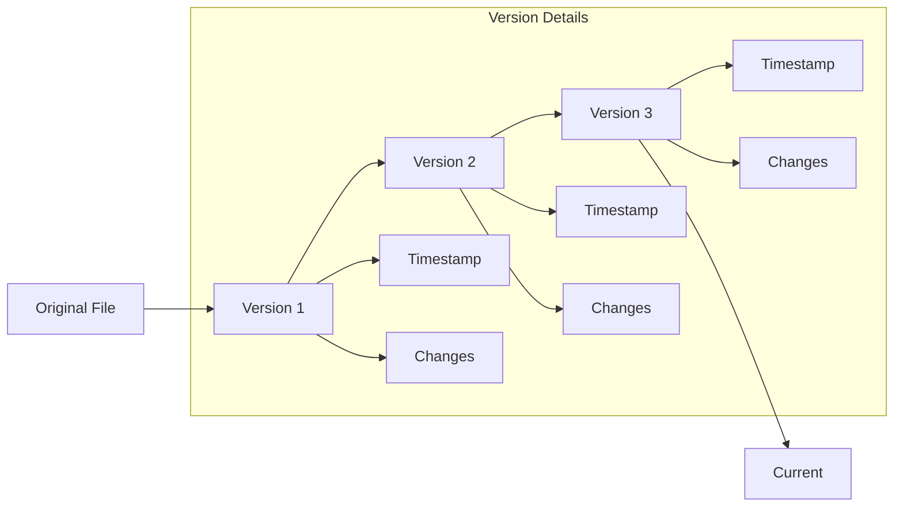

## Logging System Implementation

### Logging Architecture

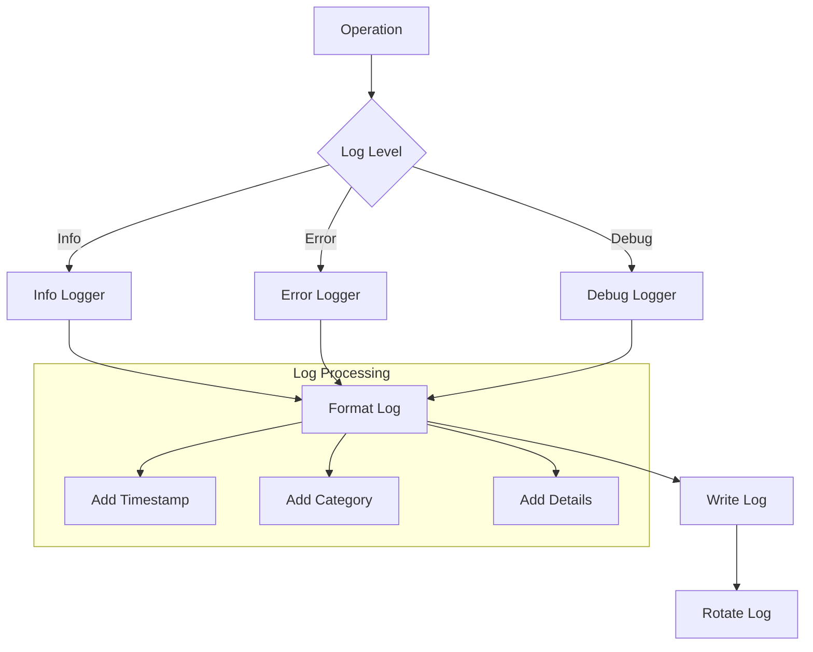

### Log Entry Structure

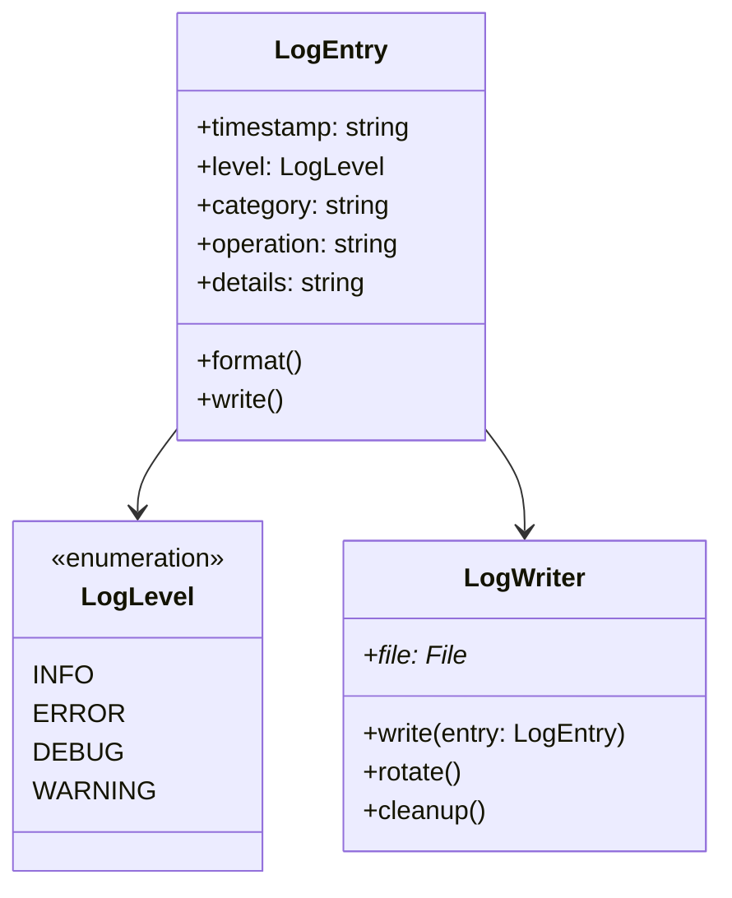

### Log File Management

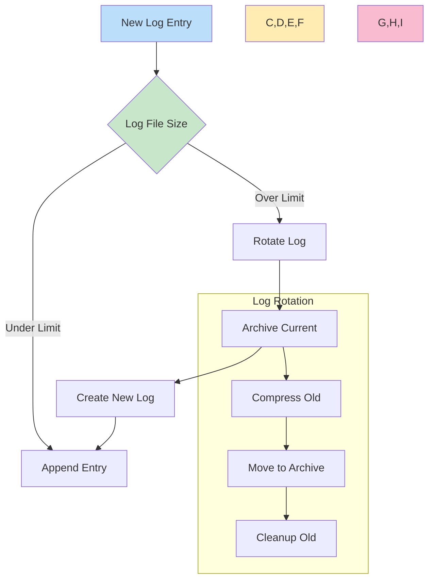

## Error Handling System

### Error Processing Flow

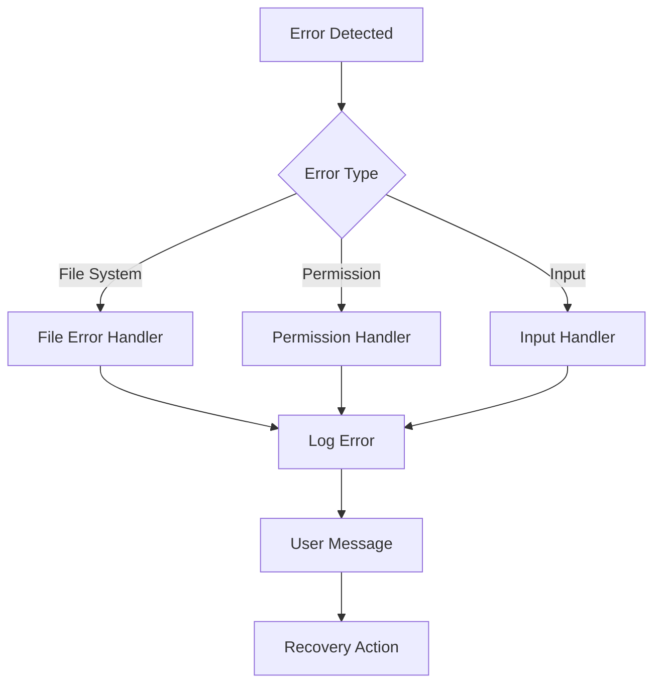

### Error Recovery System

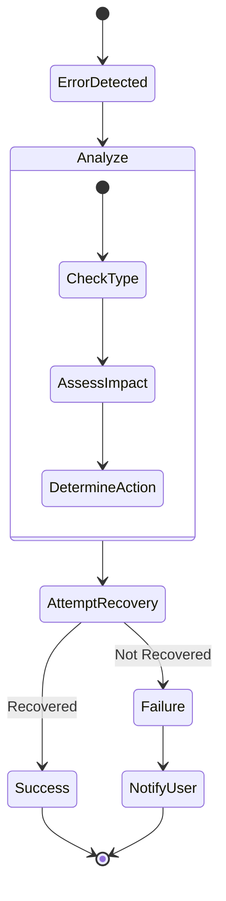

### Error Classification

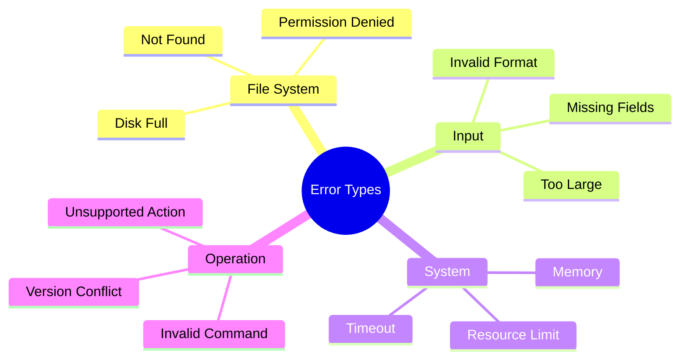

## Memory Management

### Memory Allocation Flow

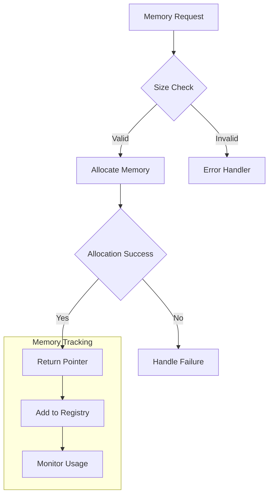

### Memory Cleanup Process

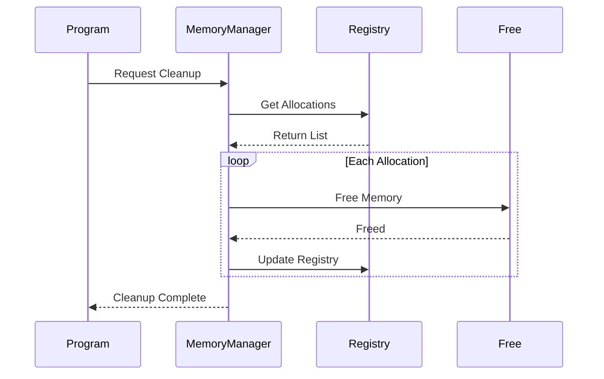

### Resource Management

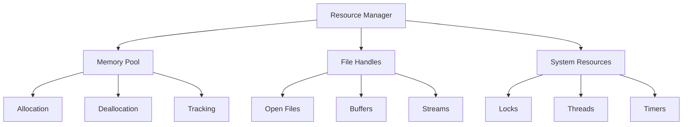

## Implementation Tips

### Best Practices

1. **Code Organization**
   - Keep functions small and focused
   - Use meaningful names
   - Comment complex logic
   - Follow consistent style

2. **Error Handling**
   - Always check return values
   - Provide meaningful error messages
   - Log errors appropriately
   - Implement recovery mechanisms

3. **Memory Management**
   - Track all allocations
   - Free resources properly
   - Check for memory leaks
   - Use appropriate buffer sizes

4. **Testing**
   - Write unit tests
   - Test edge cases
   - Validate input thoroughly
   - Test error conditions

### Common Pitfalls to Avoid

1. **Memory Leaks**
   - Not freeing allocated memory
   - Losing track of pointers
   - Not closing files
   - Buffer overflows

2. **Error Handling**
   - Ignoring return values
   - Silent failures
   - Incomplete error recovery
   - Missing error logs

3. **File Operations**
   - Not checking file existence
   - Incorrect permissions
   - Not handling full disk
   - File locking issues

4. **Version Control**
   - Not backing up before updates
   - Incorrect version naming
   - Lost version history
   - Inconsistent versioning

### Implementation Details for Command Processing

#### Command Parser Implementation
```c
// Command parser function
command_args_t parse_arguments(int argc, char *argv[]) {
    command_args_t args = {
        .cmd_type = CMD_INVALID,
        .category = NULL,
        .filename = NULL,
        .valid = false
    };

    // Validate argument count
    if (argc < 4) {
        return args;
    }

    // Parse command type
    if (strcmp(argv[1], "create") == 0) {
        args.cmd_type = CMD_CREATE;
    } else if (strcmp(argv[1], "read") == 0) {
        args.cmd_type = CMD_READ;
    } // ... other commands

    args.category = argv[2];
    args.filename = argv[3];
    args.valid = true;
    return args;
}
```

#### Command Validation
```c
// Validate command input
bool validate_command(command_args_t *args) {
    // Check category
    if (!validate_category(args->category)) {
        log_error("Invalid category");
        return false;
    }

    // Check filename
    if (!validate_filename(args->filename)) {
        log_error("Invalid filename");
        return false;
    }

    return true;
}
```

### Implementation Details for File Operations

#### File Creation Example
```c
bool create_document(const char *category, const char *filename) {
    char filepath[MAX_PATH_LENGTH];
    snprintf(filepath, MAX_PATH_LENGTH, "data/%s/%s", category, filename);

    // Check if file exists
    if (file_exists(filepath)) {
        log_error("File already exists");
        return false;
    }

    // Create file
    FILE *fp = fopen(filepath, "w");
    if (!fp) {
        log_error("Failed to create file");
        return false;
    }

    // Write content
    bool success = write_content(fp);
    fclose(fp);

    if (success) {
        log_info("Document created successfully");
    }
    return success;
}
```

#### File Update with Version Control
```c
bool update_document(const char *category, const char *filename) {
    // Create backup before update
    if (!create_version_backup(category, filename)) {
        log_error("Failed to create backup");
        return false;
    }

    // Perform update
    char filepath[MAX_PATH_LENGTH];
    snprintf(filepath, MAX_PATH_LENGTH, "data/%s/%s", category, filename);
    
    FILE *fp = fopen(filepath, "w");
    if (!fp) {
        log_error("Failed to open file for update");
        return false;
    }

    bool success = write_content(fp);
    fclose(fp);

    if (success) {
        log_info("Document updated successfully");
    }
    return success;
}
```

### Implementation Details for Version Control

#### Version Naming Function
```c
char* generate_version_name(const char *category, const char *filename) {
    time_t now = time(NULL);
    struct tm *t = localtime(&now);
    
    char *version_name = malloc(MAX_PATH_LENGTH);
    snprintf(version_name, MAX_PATH_LENGTH,
             "data/versions/%s_%04d%02d%02d_%02d%02d%02d_%s",
             category,
             t->tm_year + 1900, t->tm_mon + 1, t->tm_mday,
             t->tm_hour, t->tm_min, t->tm_sec,
             filename);
    
    return version_name;
}
```

#### Backup Creation
```c
bool create_version_backup(const char *category, const char *filename) {
    char source[MAX_PATH_LENGTH];
    snprintf(source, MAX_PATH_LENGTH, "data/%s/%s", category, filename);
    
    char *dest = generate_version_name(category, filename);
    if (!dest) {
        return false;
    }

    bool success = copy_file(source, dest);
    free(dest);
    
    if (success) {
        log_info("Version backup created");
    }
    return success;
}
```

### Implementation Details for Logging System

#### Log Entry Creation
```c
typedef struct {
    time_t timestamp;
    log_level_t level;
    char *message;
    char *category;
    char *operation;
} log_entry_t;

log_entry_t* create_log_entry(log_level_t level, const char *msg) {
    log_entry_t *entry = malloc(sizeof(log_entry_t));
    if (!entry) return NULL;

    entry->timestamp = time(NULL);
    entry->level = level;
    entry->message = strdup(msg);
    
    return entry;
}
```

#### Log Writing
```c
bool write_log_entry(log_entry_t *entry) {
    FILE *fp = fopen("data/logs/history.txt", "a");
    if (!fp) return false;

    char timestamp[32];
    strftime(timestamp, sizeof(timestamp),
             "%Y-%m-%d %H:%M:%S",
             localtime(&entry->timestamp));

    fprintf(fp, "[%s] %s: %s\n",
            timestamp,
            log_level_to_string(entry->level),
            entry->message);

    fclose(fp);
    return true;
}
```

### Implementation Details for Error Handling

#### Error Handler Implementation
```c
typedef struct {
    error_type_t type;
    int code;
    char *message;
    char *details;
} error_info_t;

void handle_error(error_info_t *error) {
    // Log the error
    log_error(error->message);

    // Perform recovery based on error type
    switch (error->type) {
        case ERROR_FILE_SYSTEM:
            handle_file_system_error(error);
            break;
        case ERROR_PERMISSION:
            handle_permission_error(error);
            break;
        // ... other error types
    }

    // Notify user
    print_error_message(error);
}
```

#### Recovery Actions
```c
bool handle_file_system_error(error_info_t *error) {
    switch (error->code) {
        case ERR_FILE_NOT_FOUND:
            return attempt_file_recovery(error->details);
        case ERR_DISK_FULL:
            return cleanup_temp_files();
        case ERR_CORRUPT_FILE:
            return restore_from_backup(error->details);
        default:
            return false;
    }
}
```

### Implementation Details for Memory Management

#### Memory Tracking
```c
typedef struct {
    void *ptr;
    size_t size;
    char *allocation_point;
    time_t timestamp;
} memory_block_t;

typedef struct {
    memory_block_t **blocks;
    size_t count;
    size_t capacity;
} memory_registry_t;

memory_registry_t* registry_init(void) {
    memory_registry_t *registry = malloc(sizeof(memory_registry_t));
    if (!registry) return NULL;

    registry->blocks = malloc(sizeof(memory_block_t*) * INITIAL_CAPACITY);
    registry->count = 0;
    registry->capacity = INITIAL_CAPACITY;

    return registry;
}
```

#### Memory Allocation Wrapper
```c
void* safe_malloc(size_t size, const char *location) {
    void *ptr = malloc(size);
    if (!ptr) {
        log_error("Memory allocation failed");
        return NULL;
    }

    // Track allocation
    memory_block_t *block = create_memory_block(ptr, size, location);
    if (!block) {
        free(ptr);
        return NULL;
    }

    add_to_registry(block);
    return ptr;
}
```

### Configuration Management

#### Config File Structure
```json
{
    "storage": {
        "base_path": "data",
        "categories": ["notes", "recipes"],
        "max_file_size": 1048576,
        "version_retention": 30
    },
    "logging": {
        "level": "INFO",
        "file": "data/logs/history.txt",
        "max_size": 5242880,
        "rotate_count": 5
    },
    "security": {
        "allowed_extensions": [".txt", ".md"],
        "max_filename_length": 255,
        "require_confirmation": true
    }
}
```

#### Config Loading
```c
bool load_config(const char *config_file) {
    FILE *fp = fopen(config_file, "r");
    if (!fp) {
        log_error("Failed to open config file");
        return false;
    }

    char *content = read_file_content(fp);
    fclose(fp);

    if (!content) {
        return false;
    }

    config_t *config = parse_json_config(content);
    free(content);

    if (!config) {
        log_error("Failed to parse config");
        return false;
    }

    apply_config(config);
    return true;
}
```

### Testing Framework

#### Unit Test Structure
```c
typedef struct {
    char *name;
    void (*setup)(void);
    void (*teardown)(void);
    void (*test_func)(void);
} test_case_t;

typedef struct {
    char *suite_name;
    test_case_t *cases;
    int case_count;
} test_suite_t;
```

#### Test Implementation Example
```c
void test_create_document(void) {
    // Setup
    const char *category = "test";
    const char *filename = "test_doc.txt";
    
    // Test
    bool result = create_document(category, filename);
    
    // Assert
    assert(result == true);
    assert(file_exists("data/test/test_doc.txt"));
    
    // Verify content
    char *content = read_document(category, filename);
    assert(content != NULL);
    assert(strcmp(content, "test content") == 0);
    
    free(content);
}
```

### Security Considerations

#### Input Validation
```c
bool validate_filename(const char *filename) {
    // Check length
    if (strlen(filename) > MAX_FILENAME_LENGTH) {
        return false;
    }

    // Check for directory traversal
    if (strstr(filename, "..") != NULL) {
        return false;
    }

    // Check allowed characters
    for (const char *p = filename; *p; p++) {
        if (!is_allowed_char(*p)) {
            return false;
        }
    }

    return true;
}
```

#### Permission Checking
```c
bool check_permissions(const char *filepath, int required_perms) {
    struct stat st;
    if (stat(filepath, &st) != 0) {
        return false;
    }

    // Check user permissions
    if ((st.st_mode & required_perms) != required_perms) {
        return false;
    }

    // Check ownership
    uid_t current_uid = geteuid();
    if (st.st_uid != current_uid) {
        return false;
    }

    return true;
}
```
