# NoteCLI Development Guide for Beginners

This comprehensive guide will walk you through building the NoteCLI application step by step, with detailed explanations suitable for beginners.

## 📚 Table of Contents
1. [Development Environment Setup](#development-environment-setup)
2. [Project Structure Creation](#project-structure-creation)
3. [Core Components Development](#core-components-development)
4. [Building and Testing](#building-and-testing)
5. [Advanced Features Implementation](#advanced-features-implementation)

## 🔧 Development Environment Setup

### Required Tools Installation

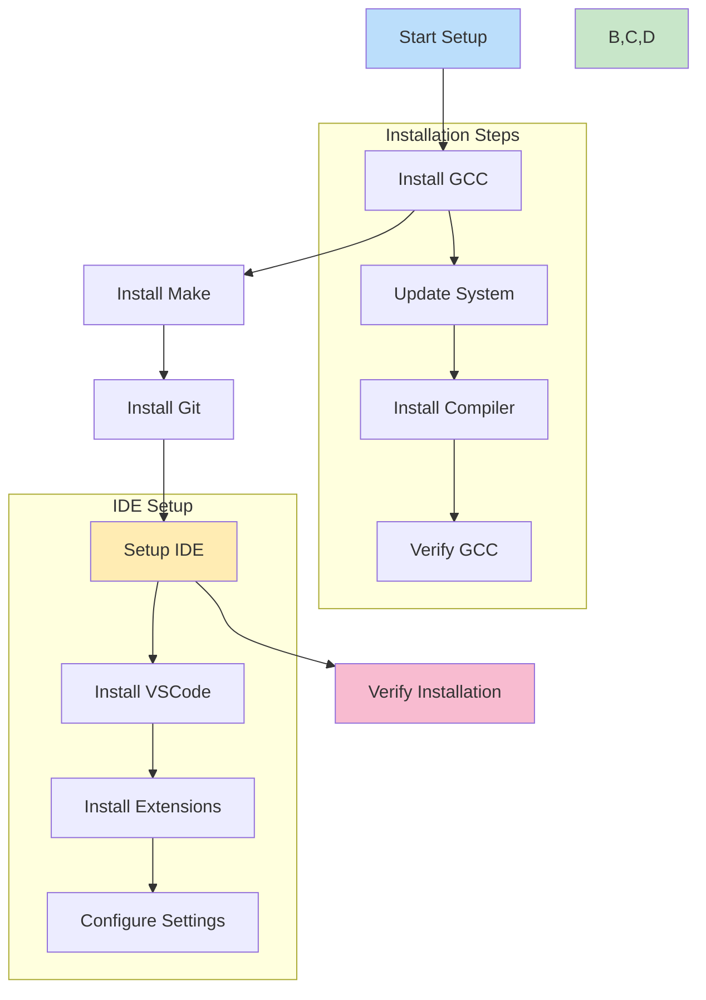

### Step-by-Step Installation

1. **Update Your System**
   ```bash
   # For Ubuntu/Debian
   sudo apt-get update && sudo apt-get upgrade
   
   # For Fedora
   sudo dnf update
   ```

2. **Install GCC Compiler**
   ```bash
   # For Ubuntu/Debian
   sudo apt-get install build-essential
   
   # For Fedora
   sudo dnf install gcc
   
   # Verify installation
   gcc --version
   ```

3. **Install Make Build System**
   ```bash
   # For Ubuntu/Debian
   sudo apt-get install make
   
   # For Fedora
   sudo dnf install make
   
   # Verify installation
   make --version
   ```

4. **Install Git**
   ```bash
   # For Ubuntu/Debian
   sudo apt-get install git
   
   # For Fedora
   sudo dnf install git
   
   # Verify installation
   git --version
   ```

## 📁 Project Structure Creation

### Directory Structure Overview

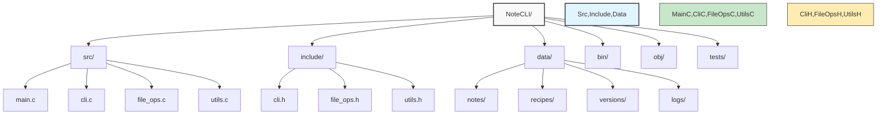

### Creating Project Structure

1. **Create Base Directory**
   ```bash
   mkdir NoteCLI
   cd NoteCLI
   ```

2. **Create Subdirectories**
   ```bash
   # Create main directories
   mkdir -p src include data bin obj tests
   
   # Create data subdirectories
   mkdir -p data/{notes,recipes,versions,logs}
   ```

3. **Create Initial Files**
   ```bash
   # Create source files
   touch src/main.c src/cli.c src/file_ops.c src/utils.c
   
   # Create header files
   touch include/cli.h include/file_ops.h include/utils.h
   
   # Create build and documentation files
   touch Makefile README.md
   ```

## 🔨 Core Components Development

### Component Dependencies

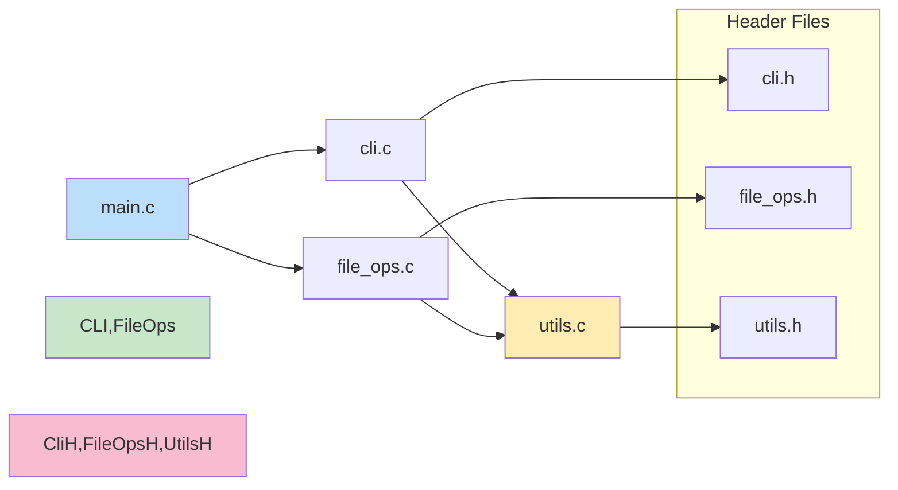

### Step-by-Step Implementation

1. **Header Files Implementation**

First, implement the header files as they define the structure:

a. **cli.h** - Command Line Interface
```c
#ifndef CLI_H
#define CLI_H

#include <stdbool.h>

// Command types
typedef enum {
    CMD_CREATE,
    CMD_READ,
    CMD_UPDATE,
    CMD_DELETE,
    CMD_INVALID
} command_type_t;

// Command arguments structure
typedef struct {
    command_type_t cmd_type;
    char *category;
    char *filename;
    bool valid;
} command_args_t;

// Function declarations
command_args_t parse_arguments(int argc, char *argv[]);
void print_usage(void);
bool confirm_action(const char *prompt);

#endif // CLI_H
```

b. **file_ops.h** - File Operations
```c
#ifndef FILE_OPS_H
#define FILE_OPS_H

#include <stdbool.h>

// File operation functions
bool create_document(const char *category, const char *filename);
bool read_document(const char *category, const char *filename);
bool update_document(const char *category, const char *filename);
bool delete_document(const char *category, const char *filename);

#endif // FILE_OPS_H
```

c. **utils.h** - Utility Functions
```c
#ifndef UTILS_H
#define UTILS_H

#include <stdbool.h>

// Utility functions
void log_error(const char *message);
void log_info(const char *message);
char *get_timestamp(void);
bool validate_filename(const char *filename);
bool validate_category(const char *category);

#endif // UTILS_H
```

2. **Source Files Implementation**

Implementation sequence diagram:

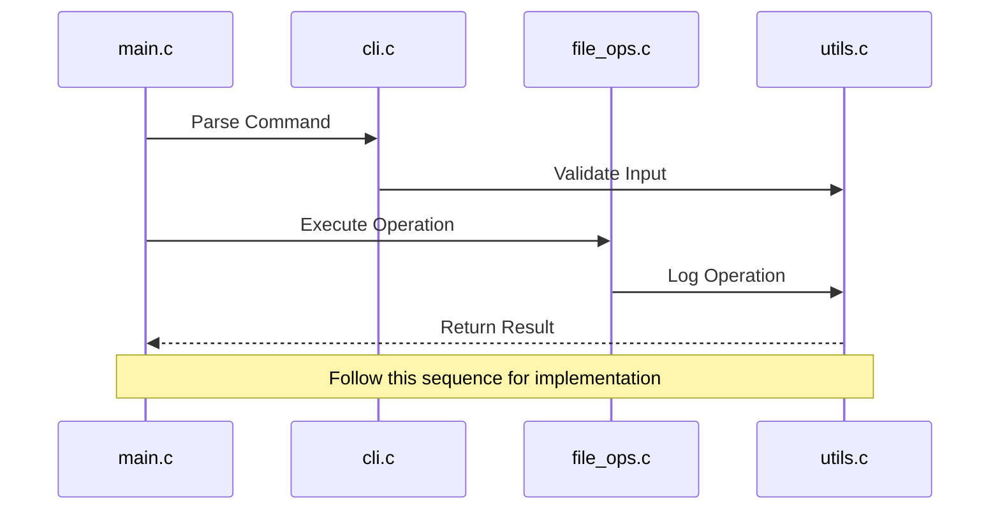

### Implementation Order and Dependencies

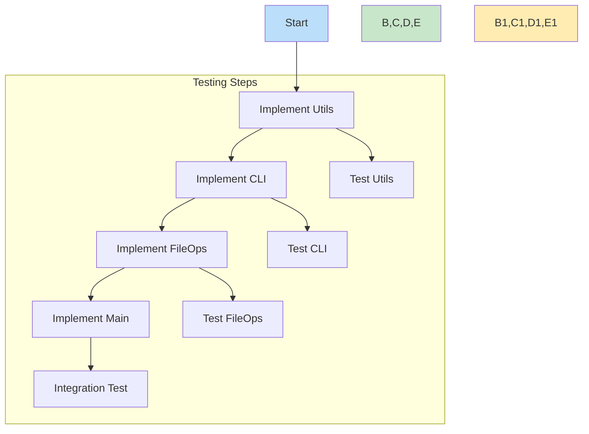

## 🛠️ Building and Testing

### Build System Setup

1. **Create Makefile**
```makefile
# Compiler and flags
CC = gcc
CFLAGS = -Wall -Wextra -I./include

# Directories
SRC_DIR = src
OBJ_DIR = obj
BIN_DIR = bin

# Source and object files
SRCS = $(wildcard $(SRC_DIR)/*.c)
OBJS = $(SRCS:$(SRC_DIR)/%.c=$(OBJ_DIR)/%.o)
TARGET = $(BIN_DIR)/NotesCLI

# Main targets
.PHONY: all clean test

all: $(TARGET)

$(TARGET): $(OBJS)
    @mkdir -p $(BIN_DIR)
    $(CC) $(OBJS) -o $(TARGET)

$(OBJ_DIR)/%.o: $(SRC_DIR)/%.c
    @mkdir -p $(OBJ_DIR)
    $(CC) $(CFLAGS) -c $< -o $@

clean:
    rm -rf $(OBJ_DIR) $(BIN_DIR)

test: all
    ./tests/run_tests.sh
```

### Build Process Flow

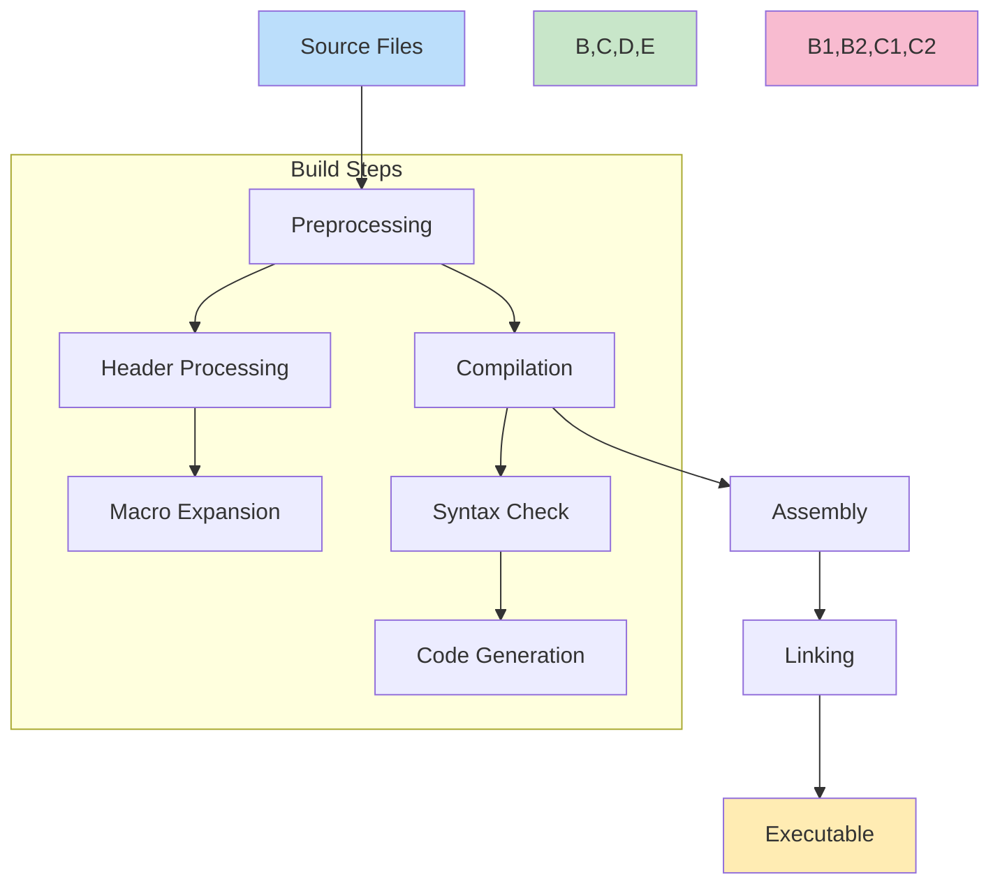

### Testing Implementation

1. **Create Test Files**
```bash
mkdir -p tests
touch tests/test_cli.c tests/test_file_ops.c tests/test_utils.c
touch tests/run_tests.sh
```

2. **Test Structure**

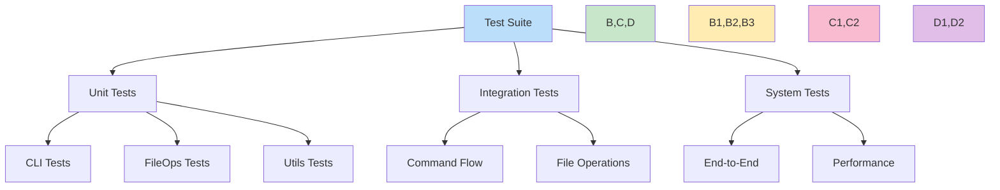

## 🎨 Advanced Features Implementation

### Version Control System

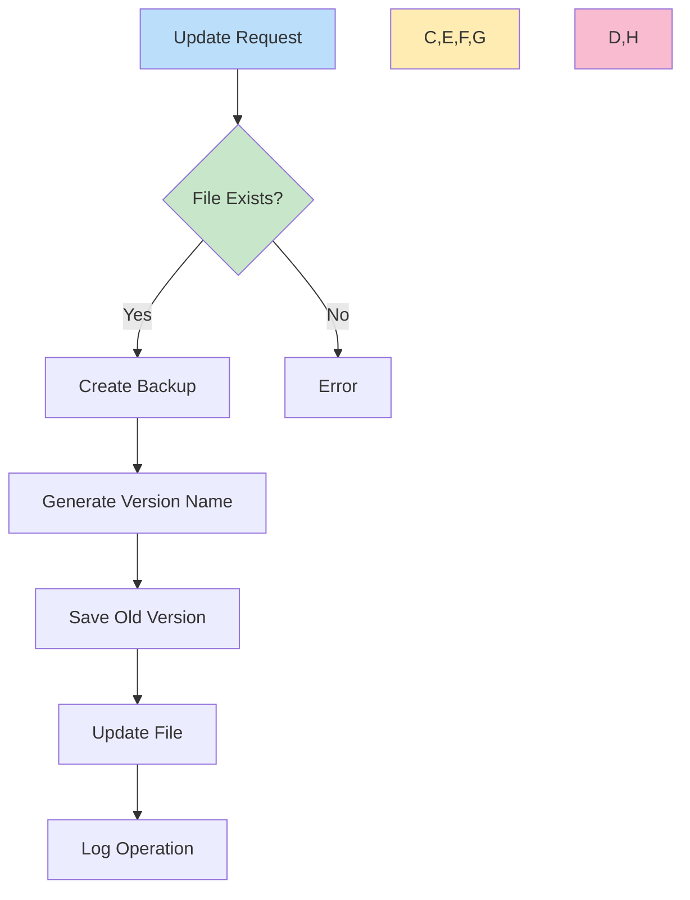

### Logging System

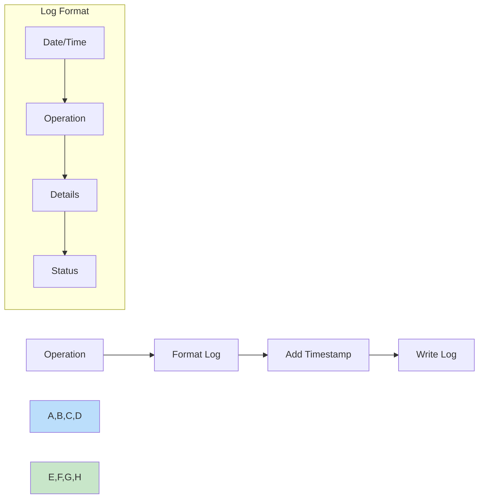

## 📝 Development Best Practices

### Code Organization

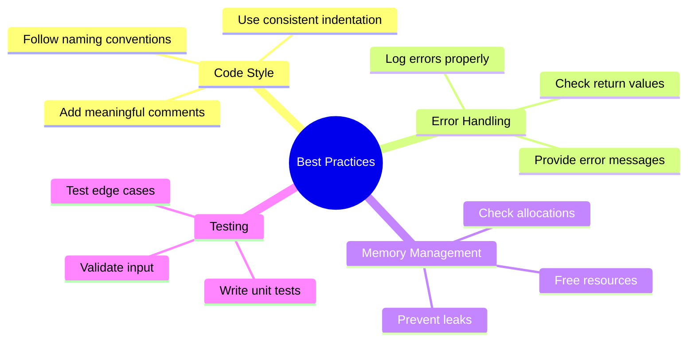

### Debugging Tips

1. **Common Issues and Solutions**
   - Build errors
   - Runtime errors
   - Memory leaks
   - File permission issues

2. **Debugging Process**
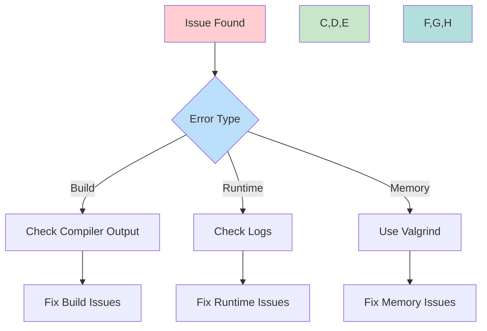

## 🔍 Additional Resources

1. **Documentation**
   - [C Programming Guide](https://en.cppreference.com/w/c)
   - [Make Documentation](https://www.gnu.org/software/make/manual/)
   - [Git Documentation](https://git-scm.com/doc)

2. **Tools**
   - [GCC Documentation](https://gcc.gnu.org/onlinedocs/)
   - [Valgrind User Manual](https://valgrind.org/docs/manual/manual.html)
   - [VSCode C/C++ Extension](https://code.visualstudio.com/docs/languages/cpp)

## 🎯 Next Steps

After completing the basic implementation:

1. Add error handling
2. Implement logging
3. Add version control
4. Write tests
5. Document the code
6. Optimize performance

Remember to commit your changes regularly and maintain a clean git history! 