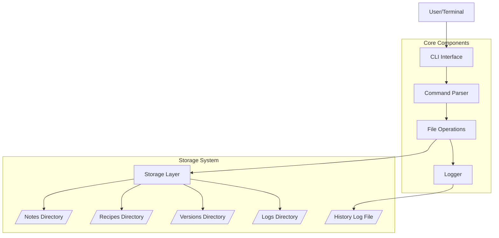
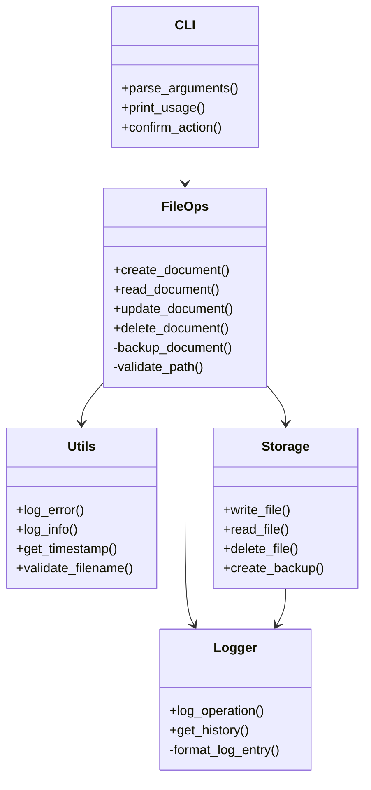
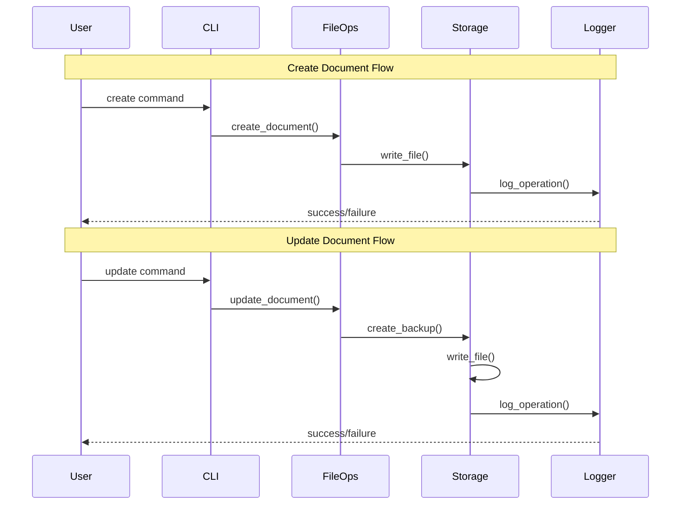
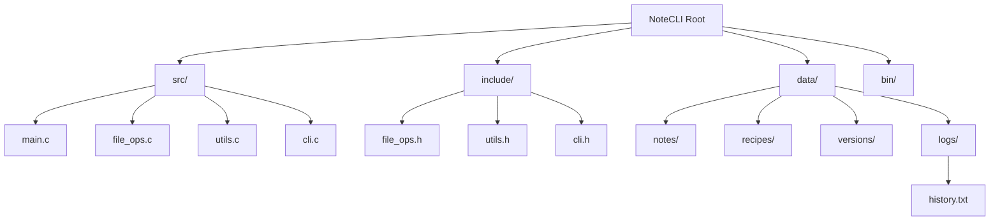
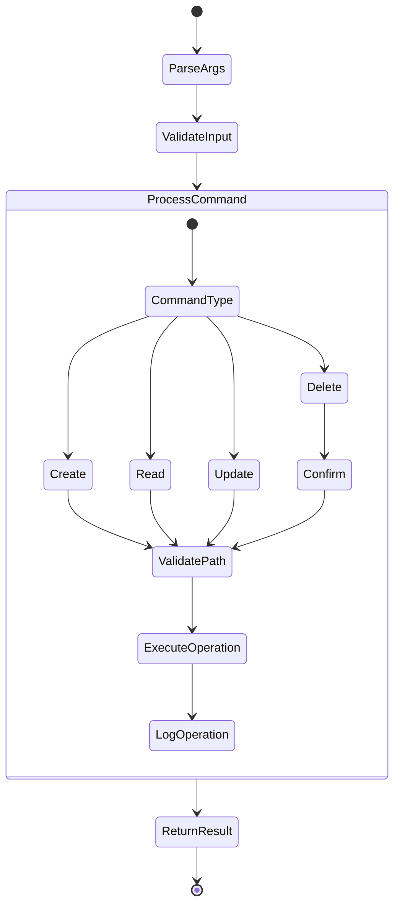
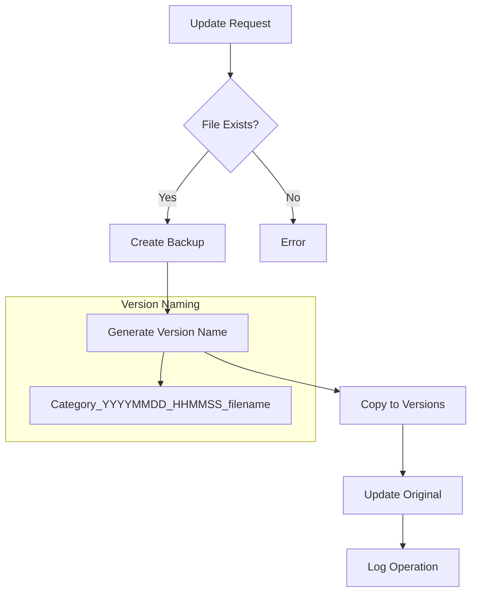

# NoteCLI System Design Documentation

This document provides a comprehensive system design overview of the NoteCLI application, including its architecture, components, data flow, and file organization.

## Table of Contents
1. [System Architecture](#system-architecture)
2. [Component Diagram](#component-diagram)
3. [Data Flow](#data-flow)
4. [File System Organization](#file-system-organization)
5. [Command Processing Flow](#command-processing-flow)
6. [Version Control System](#version-control-system)

## System Architecture

The following diagram shows the high-level architecture of NoteCLI:

## Component Diagram

Detailed breakdown of system components and their relationships:

## Data Flow

The following diagram illustrates the data flow for different operations:

## File System Organization

Directory structure and file organization:

## Command Processing Flow

The flow of command processing in the system:

## Version Control System

Version control and backup system flow:

## Implementation Details

### Core Components

1. **CLI Interface (cli.c)**
   - Handles command-line argument parsing
   - Provides user interaction functions
   - Validates input parameters

2. **File Operations (file_ops.c)**
   - Manages document CRUD operations
   - Handles file system interactions
   - Implements version control logic

3. **Utilities (utils.c)**
   - Provides helper functions
   - Handles logging operations
   - Implements validation functions

4. **Storage System**
   - Organized directory structure
   - Version control implementation
   - Operation logging system

### Security Features

1. **Input Validation**
   - Filename sanitization
   - Path traversal prevention
   - Category validation

2. **Error Handling**
   - Comprehensive error messages
   - Operation logging
   - Failure recovery

### Logging System

1. **Operation Logging**
   - Timestamp-based entries
   - Operation type recording
   - File path tracking

2. **Version Control**
   - Automatic backup creation
   - Version naming convention
   - History preservation 