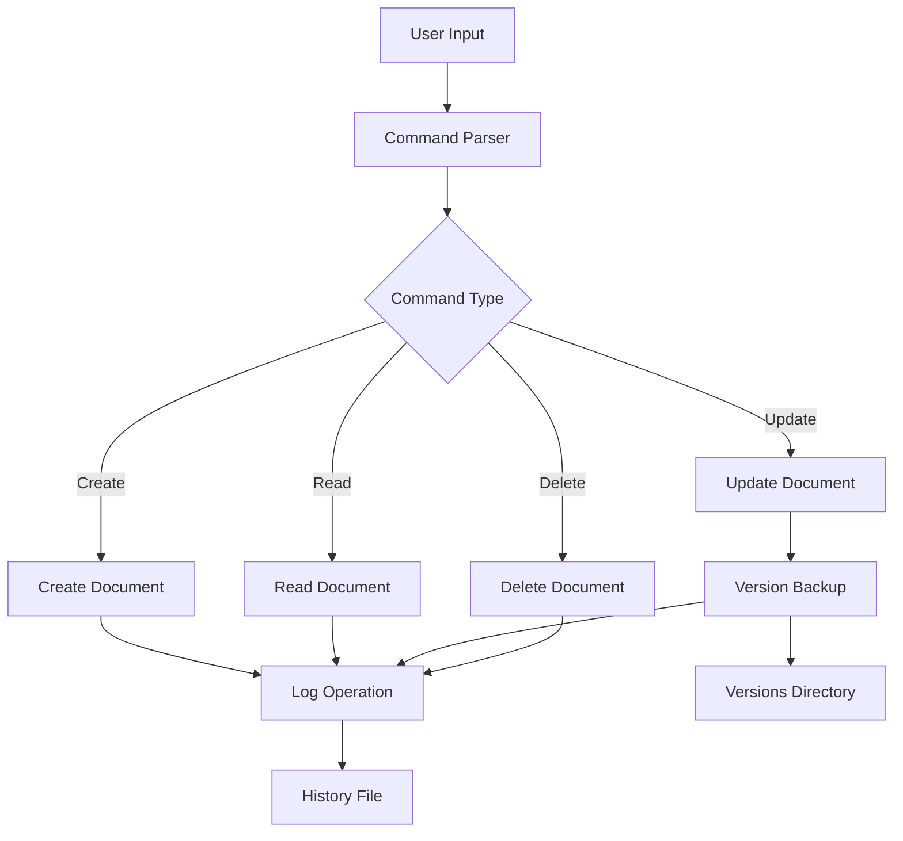
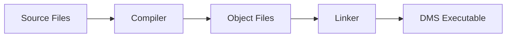
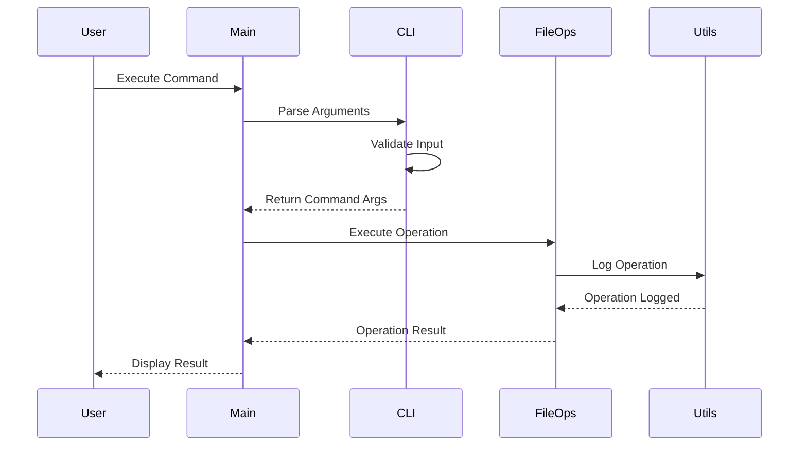
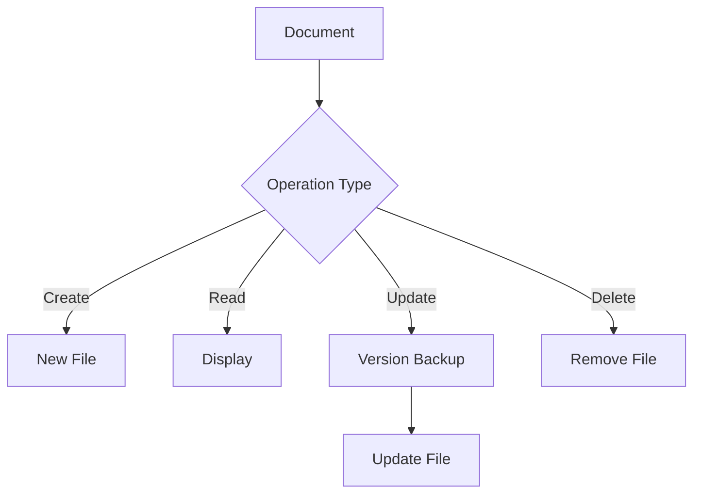
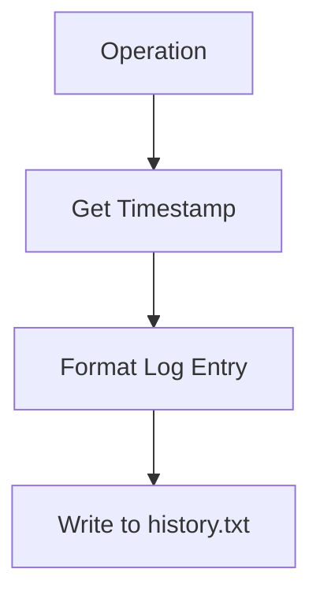
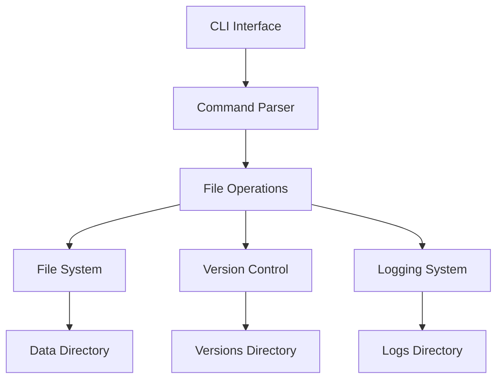
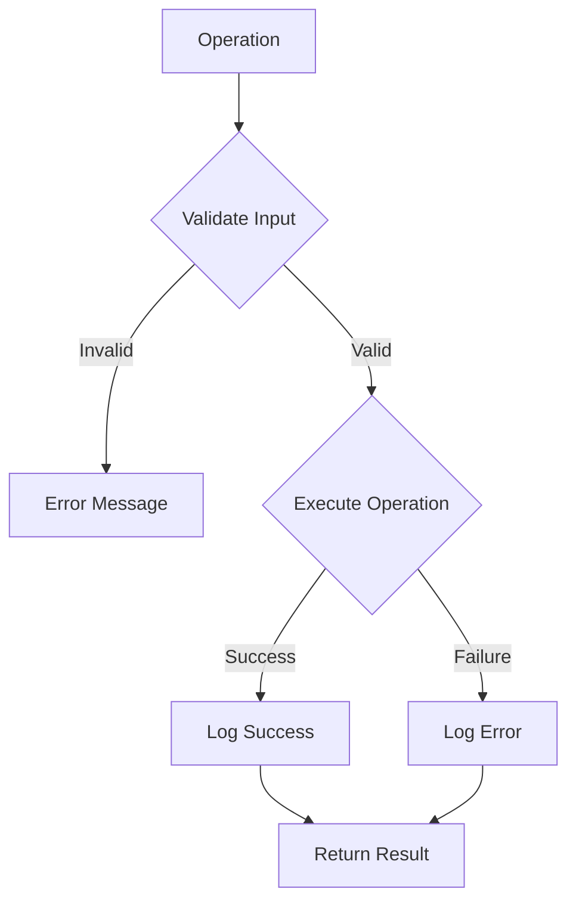

# Document Management System (DMS) - System Architecture and Workflow

## 1. System Overview Diagram



## 2. Directory Structure and Files

```
DocumentManager/
│
├── 📁 src/                  # Source code files
│   ├── 📄 main.c           # Entry point
│   ├── 📄 cli.c            # Command parsing
│   ├── 📄 file_ops.c       # File operations
│   └── 📄 utils.c          # Utility functions
│
├── 📁 include/             # Header files
│   ├── 📄 cli.h           # CLI definitions
│   ├── 📄 file_ops.h      # Operations interface
│   └── 📄 utils.h         # Utilities interface
│
├── 📁 data/               # Data storage
│   ├── 📁 recipes/        # Recipe files
│   ├── 📁 notes/          # Note files
│   ├── 📁 logs/          # Operation logs
│   └── 📁 versions/      # Version backups
│
|___📁Doocs
|    |__ 📄 Daigram.md
|    |__ 📄 Design_Rationale.md
|    |__ 📄 Excalidraw_Diagram.md
|
├── 📄 Makefile           # Build configuration
└── 📄 README.md          # Documentation
```

## 3. Build Process



1. **Compilation Steps**:
   ```bash
   # 1. Create object directory
   mkdir -p obj/
   
   # 2. Compile source files
   gcc -c src/main.c -o obj/main.o
   gcc -c src/cli.c -o obj/cli.o
   gcc -c src/file_ops.c -o obj/file_ops.o
   gcc -c src/utils.c -o obj/utils.o
   
   # 3. Link objects
   gcc obj/*.o -o bin/dms
   ```

## 4. Code Flow Diagrams

### 4.1 Command Processing Flow



## 5. Implementation Details

### 5.1 Starting Point (main.c)
```c
int main(int argc, char *argv[]) {
    // 1. Parse command line arguments
    command_args_t args = parse_arguments(argc, argv);
    
    // 2. Execute appropriate command
    switch (args.cmd_type) {
        case CMD_CREATE: // Handle create
        case CMD_READ:   // Handle read
        case CMD_UPDATE: // Handle update
        case CMD_DELETE: // Handle delete
    }
}
```

### 5.2 Command Processing Steps

1. **Create Document**:
   ```mermaid
   graph TD
       A[Start] --> B[Validate Category]
       B --> C[Check File Exists]
       C --> D[Get User Input]
       D --> E[Write File]
       E --> F[Log Operation]
   ```

2. **Read Document**:
   ```mermaid
   graph TD
       A[Start] --> B[Validate Path]
       B --> C[Open File]
       C --> D[Read Content]
       D --> E[Display Content]
       E --> F[Log Operation]
   ```

3. **Update Document**:
   ```mermaid
   graph TD
       A[Start] --> B[Check File]
       B --> C[Backup Version]
       C --> D[Get New Content]
       D --> E[Update File]
       E --> F[Log Operation]
   ```

4. **Delete Document**:
   ```mermaid
   graph TD
       A[Start] --> B[Confirm Delete]
       B --> C[Log Operation]
       C --> D[Remove File]
   ```

## 6. Data Flow

### 6.1 File Operations


### 6.2 Logging System


## 7. How to Build and Run

### 7.1 Building the Project
1. **Clone/Create Project Structure**:
   ```bash
   mkdir -p src include data/{recipes,notes,logs,versions}
   ```

2. **Create Source Files**:
   - Copy all .c files to src/
   - Copy all .h files to include/
   - Copy Makefile to root

3. **Build**:
   ```bash
   make clean    # Clean old builds
   make         # Build new executable
   ```

### 7.2 Running the Application

1. **Basic Usage**:
   ```bash
   ./bin/dms <command> <category> <filename>
   ```

2. **Example Workflow**:
   ```bash
   # Create document
   ./bin/dms create notes todo.txt
   
   # Read document
   ./bin/dms read notes todo.txt
   
   # Update document
   ./bin/dms update notes todo.txt
   
   # Delete document
   ./bin/dms delete notes todo.txt
   ```

## 8. System Components Interaction



## 9. Error Handling Flow



## 10. Development Guidelines

1. **Adding New Features**:
   - Add function declarations in appropriate header
   - Implement in corresponding source file
   - Update main.c command handling
   - Add logging support
   - Update documentation

2. **Code Organization**:
   - CLI handling in cli.c
   - File operations in file_ops.c
   - Utilities in utils.c
   - Main logic in main.c

3. **Error Handling**:
   - Use return values for success/failure
   - Log errors with descriptive messages
   - Clean up resources on failure

4. **Memory Management**:
   - Free allocated memory
   - Check malloc return values
   - Close file handles properly 