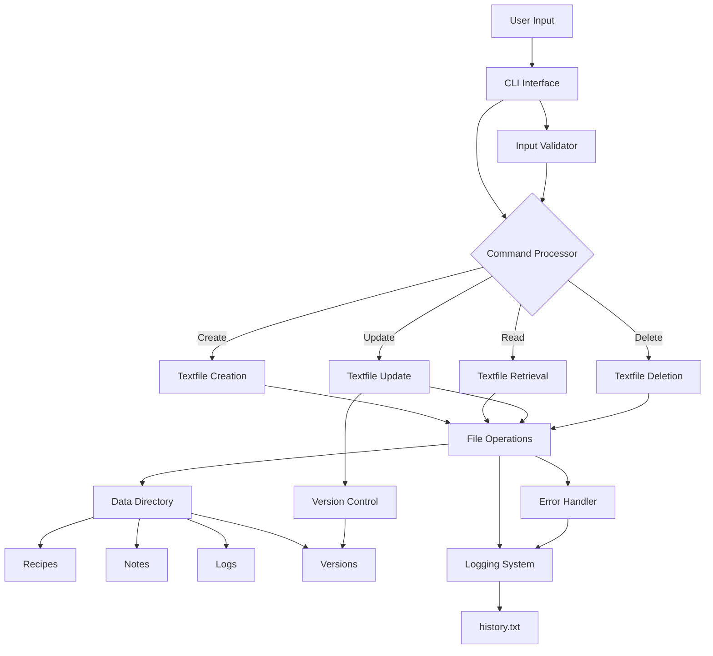

# NoteCLI - Architecture Diagram

This diagram illustrates the complete architecture of our Notepad Command Line Base (NoteCLI). Here's what each component represents:

## Core Components
- **User Input**: Entry point for all user commands
- **CLI Interface**: Handles command-line interaction
- **Command Processor**: Routes commands to appropriate handlers

## Operations
- **Textfile Creation**: Handles new Textfile creation
- **Textfile Retrieval**: Manages Textfile reading
- **Textfile Update**: Processes Textfile modifications
- **Textfile Deletion**: Manages Textfile removal

## Storage
- **Data Directory**: Root storage location
  - Recipes: Storage for recipe Textfiles
  - Notes: Storage for note Textfiles
  - Logs: System operation logs
  - Versions: Textfile version history

## System Features
- **Logging System**: Tracks all system operations
- **Version Control**: Manages Textfile versions
- **Error Handler**: Processes and logs errors
- **Input Validator**: Ensures data integrity

## Color Legend
- Pink: User interaction points
- Light Blue: Interface components
- Light Green: Processing units
- Light Red: Core operations
- Blue: Storage components
- Yellow: System utilities 