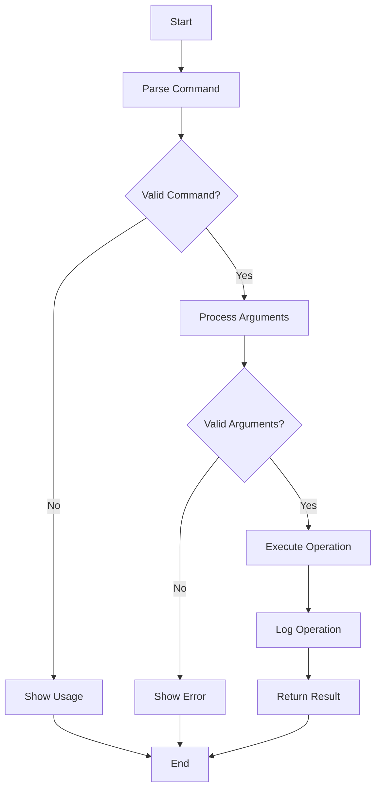
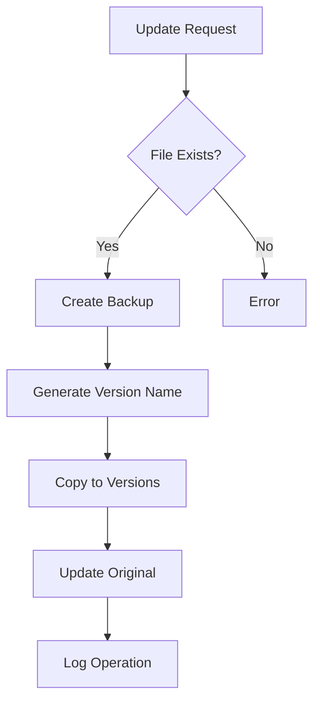
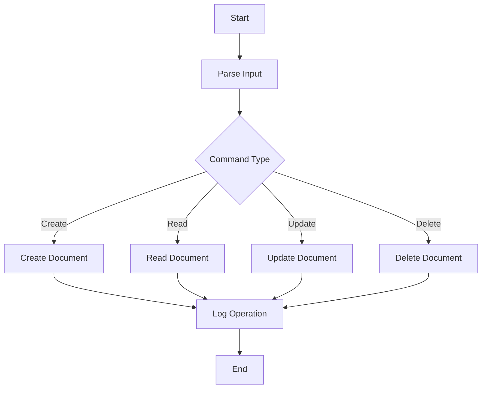
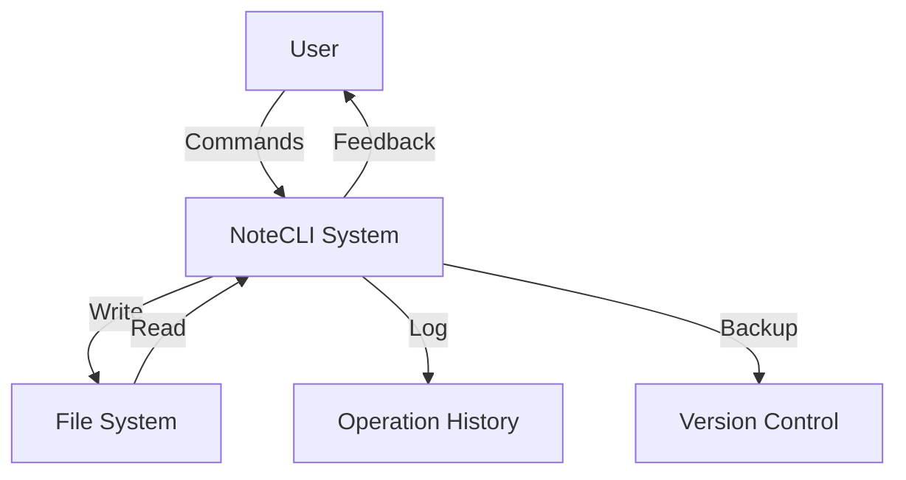
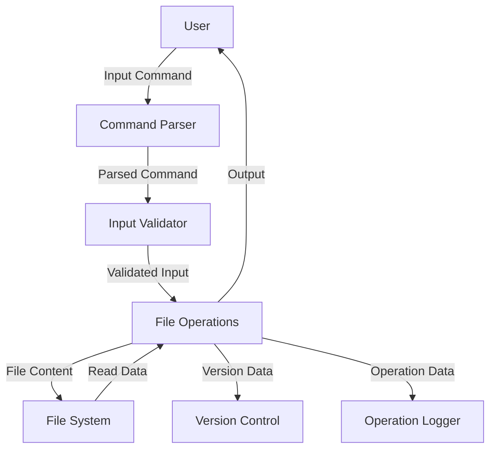
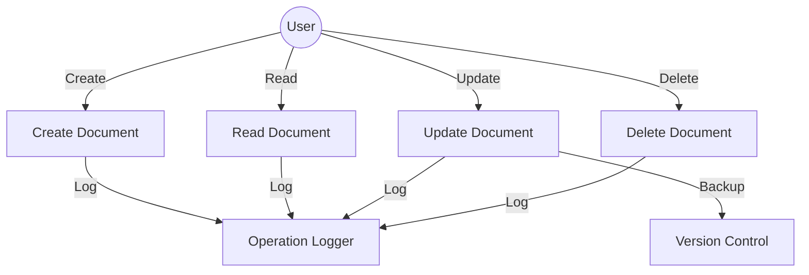

# NoteCLI - Command Line Based Notepad Application

## Title Page
**Project Title:** NoteCLI (Command Line Based Notepad Application)  
**Course:** Software Engineering  
**Semester:** Spring 2024  
**Institution:** [Your Institution Name]  
**Department:** Computer Science and Engineering  

## Acknowledgement
I would like to express my sincere gratitude to all those who have contributed to the successful completion of this project. Special thanks to:

- Project Supervisor for their guidance and support
- Faculty members for their valuable insights
- Fellow students for their feedback and suggestions
- Open source community for inspiration and resources

## Student Declaration
I hereby declare that this project work titled "NoteCLI - Command Line Based Notepad Application" is my genuine work carried out as part of the software engineering course. The work has not been submitted elsewhere for any degree or diploma.

Date: [Date]  
Place: [Place]  
Signature: [Your Name]

## Supervisor Declaration
This is to certify that the project work titled "NoteCLI - Command Line Based Notepad Application" is a bonafide record of work carried out by [Student Name] under my supervision.

Date: [Date]  
Place: [Place]  
Signature: [Supervisor Name]  
Designation: [Designation]

## Letter of Approval
This project has been approved by the Department of Computer Science and Engineering as fulfilling the requirements for the Software Engineering course.

Date: [Date]  
HOD Signature: [HOD Name]  
Department Seal

## Abstract
NoteCLI is a command-line based notepad application written in C that provides users with a robust and efficient way to manage text documents. The system implements CRUD (Create, Read, Update, Delete) operations with additional features like automatic versioning and comprehensive operation logging. The application emphasizes data organization through a dedicated notes directory, ensuring systematic document management while maintaining version history and operation tracking.

## Table of Contents
1. [Introduction](#introduction)
2. [Problem Statement](#problem-statement)
3. [Objectives](#objectives)
4. [Project Schedule](#project-schedule)
5. [Background Study](#background-study)
6. [Requirement Document](#requirement-document)
7. [System Design](#system-design)
8. [Development](#development)
9. [Testing](#testing)
10. [Project Result](#project-result)
11. [Future Enhancements](#future-enhancements)
12. [Conclusion](#conclusion)
13. [References](#references)
14. [Annex](#annex)

## 1. Introduction
NoteCLI is a modern solution for text document management through command-line interface. The application provides a seamless experience for users who prefer terminal-based operations, offering robust features like:
- Dedicated notes directory for document organization
- Automatic version control
- Comprehensive operation logging
- Error handling and validation
- Color-coded console output

## 2. Problem Statement
Traditional text editors often lack:
- Efficient document organization
- Version control for changes
- Operation history tracking
- Command-line efficiency
- Category-based management

NoteCLI addresses these limitations by providing a structured approach to document management with built-in versioning and logging capabilities.

## 3. Objectives
1. Develop a command-line based notepad application
2. Implement CRUD operations for text documents
3. Organize all documents in a single notes directory
4. Integrate automatic version control
5. Implement comprehensive operation logging
6. Ensure robust error handling and validation
7. Provide a user-friendly command-line interface

## 4. Project Schedule
# SDLC Here

## 5. Background Study
### 5.1 Existing Solutions
- Traditional text editors (vim, nano)
- GUI-based notepad applications
- Web-based note-taking tools

### 5.2 Technologies Used
- C Programming Language
- Make Build System
- Git Version Control
- Command Line Interface
- File System Operations

### 5.3 Advantages of Command Line Interface
1. Speed and efficiency
2. Resource efficiency


## 6. Requirement Document
### 6.1 Functional Requirements
1. Document Management
   - Create new documents
   - Read existing documents
   - Update document content
   - Delete documents
   - Organize documents in categories

2. Version Control
   - Automatic version backup on updates
   - Version history preservation
   - Timestamp-based version naming

3. Operation Logging
   - Log all operations with timestamps
   - Track file modifications
   - Maintain operation history

### 6.2 Non-Functional Requirements
1. Performance
   - Quick response time
   - Efficient resource usage
   - Minimal memory footprint

2. Security
   - Input validation
   - Path traversal prevention
   - File permission management

3. Reliability
   - Error handling
   - Data consistency
   - Operation atomicity

## 7. System Design
### 7.1 Feasibility Study
#### Technical Feasibility
- C programming language capabilities
- File system operations support
- Command line interface implementation
- Version control implementation
- Logging system implementation

#### Operational Feasibility
- User-friendly commands
- Clear error messages
- Efficient document organization
- Simple maintenance

#### Economic Feasibility
- Open-source development
- Minimal resource requirements
- No special hardware needed
- Low maintenance cost

### 7.2 Algorithm
Key algorithms implemented in the system:

1. Command Processing Algorithm


2. Version Control Algorithm


### 7.3 Flowchart
System Operation Flowchart:


### 7.4 Context Diagram


### 7.5 Data Flow Diagram


### 7.6 Use Case Diagram


## 8. Development
### 8.1 Implementation
#### Development Environment
1. Operating System: Linux
2. Programming Language: C
3. Build System: Make
4. Version Control: Git
5. Editor: Any text editor

#### Project Structure
```
NoteCLI/
├── bin/               # Compiled binary
├── src/               # Source code files
├── include/           # Header files
├── data/              # Document storage
│   ├── notes/         # Note documents
│   ├── logs/          # Operation logs
│   └── versions/      # Version backups
└── obj/               # Object files
```

#### Operation Procedure
1. Building the Project
```bash
make clean    # Clean old builds
make         # Build new executable
```

2. Running Commands
```bash
# Create note
./bin/NotesCLI create <filename>

# Read note
./bin/NotesCLI read <filename>

# Update note
./bin/NotesCLI update <filename>

# Delete note
./bin/NotesCLI delete <filename>
```

## 9. Testing
### 9.1 Verification and Validation
#### Test Cases

1. Document Creation
```c
void test_create_document() {
    assert(create_document("notes", "test.txt") == true);
    assert(file_exists("data/notes/test.txt") == true);
}
```

2. Document Reading
```c
void test_read_document() {
    create_document("notes", "test.txt");
    assert(read_document("notes", "test.txt") == true);
}
```

3. Document Update
```c
void test_update_document() {
    create_document("notes", "test.txt");
    assert(update_document("notes", "test.txt") == true);
    assert(file_exists("data/versions/") == true);
}
```

4. Document Deletion
```c
void test_delete_document() {
    create_document("notes", "test.txt");
    assert(delete_document("notes", "test.txt") == true);
    assert(file_exists("data/notes/test.txt") == false);
}
```

## 10. Project Result
The NoteCLI project has successfully achieved its objectives:
1. Implemented all CRUD operations
2. Created category-based organization
3. Integrated automatic version control
4. Implemented comprehensive logging
5. Ensured robust error handling
6. Provided user-friendly interface

### Demo Instructions
1. Build the project:
```bash
make clean && make
```

2. Create a note:
```bash
./bin/NotesCLI create todo.txt
# Enter content and press Ctrl+D
```

3. Read the note:
```bash
./bin/NotesCLI read todo.txt
```

4. Update the note:
```bash
./bin/NotesCLI update todo.txt
# Enter new content and press Ctrl+D
```

5. Delete the note:
```bash
./bin/NotesCLI delete todo.txt
```

## 11. Future Enhancements
1. Search Functionality
   - Full-text search
   - Category-based search
   - Tag-based organization

2. Enhanced Version Control
   - Diff viewing
   - Version comparison
   - Selective restoration

3. Multiple File Operations
   - Batch processing
   - Category operations
   - Bulk updates

4. Network Support
   - Remote storage
   - Synchronization
   - Multi-user support

5. Enhanced Security
   - Encryption
   - Access control
   - User authentication

## 12. Conclusion
The NoteCLI project demonstrates the effectiveness of command-line based document management. By implementing core features like CRUD operations, version control, and operation logging, it provides a robust solution for text document management. The modular design and clean architecture ensure maintainability and extensibility for future enhancements.

## 13. References
1. C Programming Language, 2nd Edition by Kernighan and Ritchie
2. Advanced Programming in the UNIX Environment by W. Richard Stevens
3. Version Control with Git by Jon Loeliger
4. Clean Code by Robert C. Martin
5. Design Patterns by Gamma, Helm, Johnson, Vlissides

## 14. Annex
### A. Command Reference
```bash
NotesCLI <command> <filename>

Commands:
  create  - Create a new note
  read    - Read an existing note
  update  - Update an existing note
  delete  - Delete an existing note
```

### B. Error Codes
1. E001 - Invalid command
2. E002 - Invalid category
3. E003 - Invalid filename
4. E004 - File operation failed
5. E005 - Version backup failed

### C. Configuration Options
1. MAX_INPUT_SIZE - Maximum input size (4KB)
2. MAX_FILENAME_LENGTH - Maximum filename length
3. MAX_PATH_LENGTH - Maximum path length
4. VALID_CATEGORIES - List of valid categories 