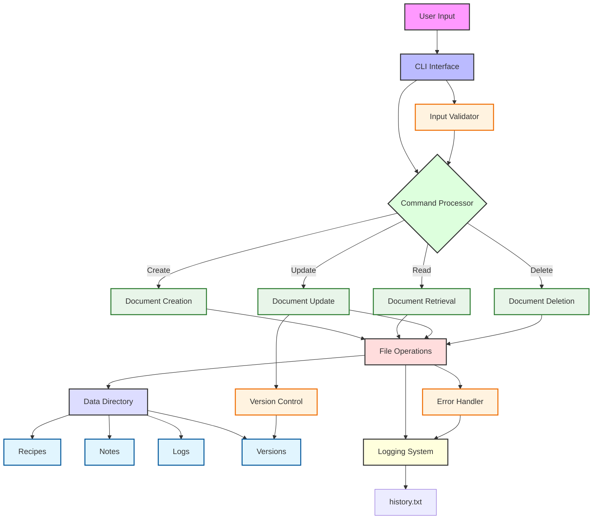

# Document Management System - Architecture Diagram

This diagram illustrates the complete architecture of our Document Management System (DMS). Here's what each component represents:

## Core Components
- **User Input**: Entry point for all user commands
- **CLI Interface**: Handles command-line interaction
- **Command Processor**: Routes commands to appropriate handlers

## Operations
- **Document Creation**: Handles new document creation
- **Document Retrieval**: Manages document reading
- **Document Update**: Processes document modifications
- **Document Deletion**: Manages document removal

## Storage
- **Data Directory**: Root storage location
  - Recipes: Storage for recipe documents
  - Notes: Storage for note documents
  - Logs: System operation logs
  - Versions: Document version history

## System Features
- **Logging System**: Tracks all system operations
- **Version Control**: Manages document versions
- **Error Handler**: Processes and logs errors
- **Input Validator**: Ensures data integrity

## Color Legend
- Pink: User interaction points
- Light Blue: Interface components
- Light Green: Processing units
- Light Red: Core operations
- Blue: Storage components
- Yellow: System utilities 